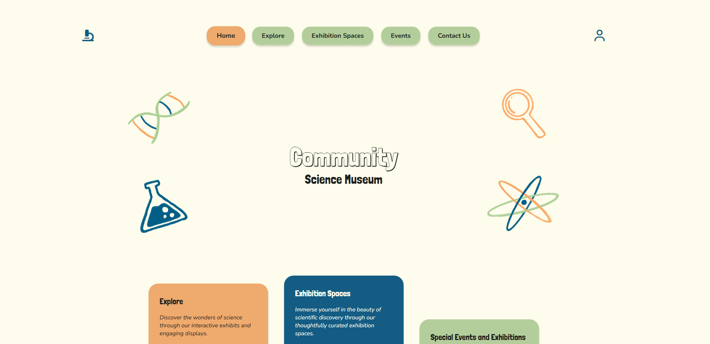
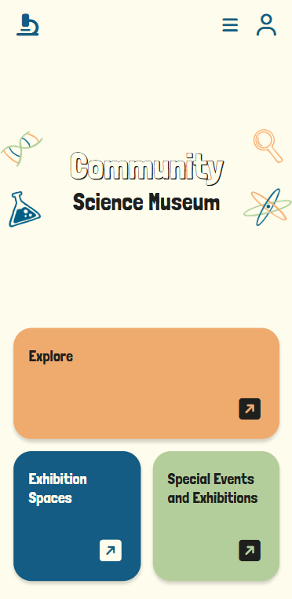

# Semester Project

This is **Community Science Museum**, a fictional science museum website aimed at teachers and students.

The site was built as part of my semester project for my front-end development studies at Noroff. The assignment was to design and build a website based on a provided description of the site and its content, along with supplied images. The site is built using only HTML and CSS, as that's what we've learned so far.




## Features

- Mobile-first responsive design
- Pure CSS hamburger menu (no JavaScript)
- CSS custom properties (`variables.css`) for colors
- Icons from Font Awesome, fonts from Google Fonts

## Site pages

- Home (`index.html`)
- Explore (`explore.html`)
- Exhibition Spaces (`exhibition-spaces.html`)
- Special Events and Exhibitions (`events.html`)
- Contact Us (`contact.html`)
- Coming Soon (`tbc.html`)

## Built with

- HTML5 & CSS3 (no JavaScript or frameworks used, as that's not yet been covered)
- [Font Awesome](https://fontawesome.com/) – icons
- [Google Fonts](https://fonts.google.com/) – Londrina Shadow, Londrina Solid, Nunito

## Project structure

```
Semester-Project/
├── index.html
├── explore.html
├── exhibition-spaces.html
├── events.html
├── contact.html
├── tbc.html
├── css/
│   ├── variables.css       # CSS custom properties (colors)
│   ├── styles.css          # shared base styles (mobile-first)
│   ├── media.css           # all responsive/desktop overrides
│   ├── index.css           # page-specific: home
│   ├── explore.css         # page-specific: explore
│   ├── exhibition-spaces.css
│   ├── events.css
│   ├── contact.css
│   └── tbc.css
├── images/                 # photos used across the pages
└── icons/                  # favicons and site manifest
```

## How to view it

Open `index.html` in your browser.

## Responsive approach

The site is coded mobile-first. All responsive CSS is collected in `media.css` with a single breakpoint (800px).

## Known limitations

The contact form doesn't submit anywhere (no backend), and the "Coming Soon" page is a placeholder.

## Images

Most images were provided with the assignment, with a few exceptions, sourced from Unsplash:

- [Group stacking hands in colorful sweaters](https://unsplash.com/photos/group-stacking-hands-in-colorful-sweaters-Zyx1bK9mqmA)
- [Woman in white laboratory gown holding black microphone](https://unsplash.com/photos/woman-in-white-laboratory-gown-holding-black-microphone-oFK7xgf4_50)
- [A little girl wearing a white lab coat and goggles](https://unsplash.com/photos/a-little-girl-wearing-a-white-lab-coat-and-goggles-WAEqUyi5CZQ)
- [Smiling woman presenting at whiteboard](http://unsplash.com/photos/smiling-woman-presenting-at-whiteboard-TXxiFuQLBKQ)

The icons used in the background of the title on the home page were created by me in Procreate.

## Author

Frida Totland
[github.com/frida-totland](https://github.com/frida-totland)
